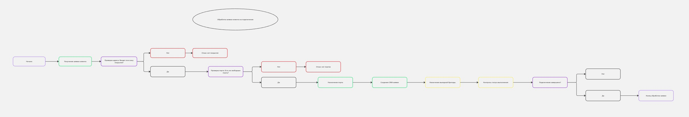
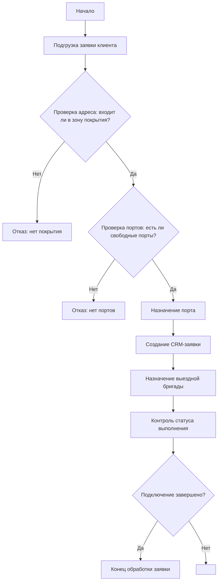

# 📡 Телеком RPA: Обработка заявок на подключение

## 📌 Описание проекта

Скрипт имитирует обработку заявок новых абонентов на подключение к телеком-услугам. Обработка включает:

- Проверку адреса на покрытие
- Проверку наличия свободных портов
- Назначение порта
- Создание заявки в CRM
- Назначение выездной бригады
- Контроль статуса подключения
- Логгирование результатов


## Диаграмма




## 🚀 Как запустить

### 1. Установите зависимости:

```bash
pip install -r requirements.txt
```
```bash
python main.py
```